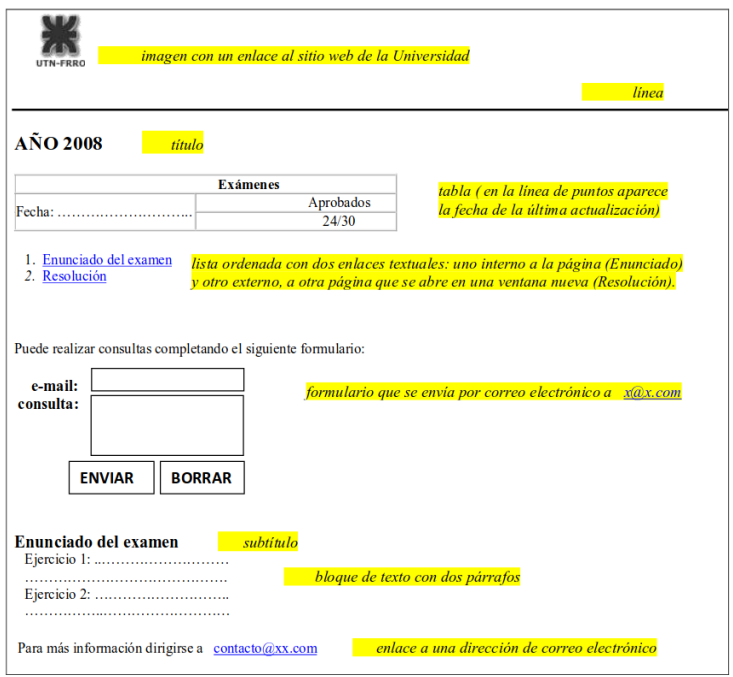
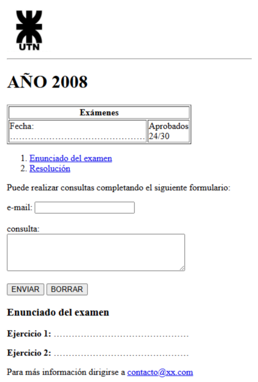
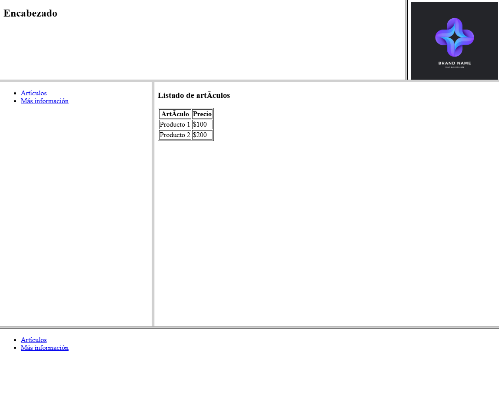

## Práctica N1 HTML

### 1.1 ¿Qué es HTML, cuándo fue creado, cuáles fueron las distintas versiones y cuál es la última?

HTML (HyperText Markup Language) es el lenguaje estándar para la creación de páginas web. Es un lenguaje de marcado que permite estructurar y presentar contenido en la web, como texto, imágenes, enlaces, formularios, etc.

- **Creado:** en 1991 por Tim Berners-Lee.
- **Versiones principales:**
  - HTML 1.0 (1991): Muy básico.
  - HTML 2.0 (1995): Estandariza etiquetas comunes.
  - HTML 3.2 (1997): Agrega tablas, scripts y applets.
  - HTML 4.01 (1999): Mejora accesibilidad y separación de contenido/estilo.
  - XHTML 1.0 (2000): Variante basada en XML.
  - HTML5 (2014): Introduce etiquetas semánticas, audio, video, canvas, APIs, etc.
- **Última versión estable:** HTML5.2 (2017). Actualmente, HTML se mantiene como un "estándar vivo" por WHATWG.

### 1.2 ¿Cuáles son los principios básicos que el W3C recomienda seguir para la creación de documentos con HTML?

El W3C recomienda:

- Accesibilidad: Contenido entendible y utilizable por todos.
- Semántica: Uso correcto de etiquetas que describen el contenido.
- Separación de contenido y presentación: HTML para estructura, CSS para estilo.
- Adherencia a los estándares web: Para asegurar compatibilidad.
- Código limpio y válido: Facilita mantenimiento y comprensión.

### 1.3 ¿Cuándo un elemento o atributo se considera desaprobado? ¿Y obsoleto?

- **Desaprobado (deprecated):** Aún funciona, pero ya no se recomienda su uso. Se mantiene por compatibilidad.
- **Obsoleto (obsolete):** Ya no se admite en la especificación y puede causar errores. Se elimina del estándar actual.

**Ejemplo:** la etiqueta `<font>` es desaprobada en HTML 4.01 y obsoleta en HTML5.

### 1.4 ¿Qué es el DTD y cuáles son los posibles DTDs contemplados en HTML 4.01?

DTD (Document Type Definition) define la estructura y reglas que debe seguir un documento HTML.

**En HTML 4.01 hay tres DTD posibles:**

1. Strict: Solo permite etiquetas y atributos válidos actuales.
2. Transitional: Acepta etiquetas desaprobadas por compatibilidad.
3. Frameset: Diseñado para usar marcos (`<frames>`).

**Ejemplo de declaración Strict:**
```html
<!DOCTYPE HTML PUBLIC "-//W3C//DTD HTML 4.01//EN" "http://www.w3.org/TR/html4/strict.dtd">
```

### 1.5 ¿Qué son los metadatos y cómo se especifican en HTML?

Los metadatos son información sobre el documento HTML que no se muestra en la página,
pero describe su contenido.
Se definen dentro de <head> usando etiquetas <meta> como estas:

````html
<meta charset="UTF-8">
<meta name="description" content="Ejemplo de documento HTML">
<meta name="author" content="Tu nombre">
<meta name="viewport" content="width=device-width, initial-scale=1.0">
````
Son útiles para navegadores, buscadores, redes sociales, etc.

---

### 2) Analizar los siguientes segmentos de código
Indicar en qué sección del documento HTML
se colocan, cuál es el efecto que producen y señalar cada uno de los elementos, etiquetas, y atributos
(nombre y valor), aclarando si es obligatorio.

### 2.a

````html
<!-- Código controlado el día 12/08/2009 -->
````

Este fragmento es un comentario HTML. No tiene efecto visual en la página y se usa para
dejar notas internas en el código. No se necesita colocarlo en un lugar específico, ya que el
navegador lo ignora completamente. No tiene atributos ni es obligatorio, pero es muy útil
para documentar el código y facilitar su lectura por parte de otros desarrolladores.

### 2.b

````html
<div id="bloque1">Contenido del bloque1</div>
````

En este caso se está utilizando un contenedor genérico, comúnmente usado para agrupar
contenido dentro del cuerpo del documento. Este elemento permite aplicar estilos o scripts
y, en este ejemplo, lleva un atributo id que lo identifica con el nombre "bloque1". Este
atributo no es obligatorio, pero es muy útil cuando se quiere trabajar con ese bloque de
forma específica.

### 2.c
 ````html
 
````

Se trata de una imagen, que también va dentro del elemento **body**. Aunque el atributo **src** está
vacío y por lo tanto no se mostrará nada, se definen otros como **alt**, que es obligatorio
desde el punto de vista de la accesibilidad, ya que describe la imagen. También hay
atributos como **id**, **name**, **width**, **height** y **longdesc**. Todos son opcionales excepto **src**
y **alt**, pero ayudan a describir y manipular la imagen correctamente.

### 2.d

````html
<meta name="keywords" lang="es" content="casa, compra, venta, alquiler " />
<meta http-equiv="expires" content="16-Sep-2019 7:49 PM" />
````

Estas etiquetas son metadatos que se ubican en la sección **head** del documento. La
primera indica palabras clave que describen el contenido de la página, útiles para los
motores de búsqueda. La segunda establece una fecha de expiración del contenido, lo cual
puede influir en la forma en que el navegador o el servidor cachea la página. Los atributos
como **name**, **lang**, **content**, y **http-equiv** no son obligatorios pero aportan información
valiosa para el funcionamiento del sitio.

### 2.e

````html
<a href="http://www.e-style.com.ar/resumen.html" type="text/html" hreflang="es" charset="utf-8"
rel="help">Resumen HTML </a>
````

Este elemento representa un enlace a otra página web. Se encuentra en el cuerpo del
documento y el atributo principal es **href**, que define el destino del enlace y es obligatorio.
Los demás atributos (**type**, **hreflang**, **charset**, **rel**) son opcionales y agregan
información adicional sobre el tipo de recurso, el idioma, la codificación y la relación entre
las páginas. Si bien no son necesarios, aportan semántica y pueden mejorar la accesibilidad
y el posicionamiento en buscadores.

### 2.f 

````html
<table width="200" summary="Datos correspondientes al ejercicio vencido">
    <caption align="top"> Título </caption>
    <tr>
        <th scope="col">&nbsp;</th>
        <th scope="col">A</th>
        <th scope="col">B</th>
        <th scope="col">C</th>
    </tr>
    <tr>
        <th scope="row">1º</th>
        <td>&nbsp;</td>
        <td>&nbsp;</td>
        <td>&nbsp;</td>
    </tr>
    <tr>
        <th scope="row">2º</th>
        <td>&nbsp;</td>
        <td>&nbsp;</td>
        <td>&nbsp;</td>
    </tr>
</table>
````

Este bloque corresponde a una tabla de datos. Se debe ubicar dentro del **body** y
contiene un título, varias filas, y celdas de encabezado y de contenido. A través de atributos
como **width**, **summary**, y **scope**, se mejora la presentación y la accesibilidad de la tabla.
Aunque estos atributos no son obligatorios, su uso es recomendable para que la tabla sea
más clara tanto para el usuario como para tecnologías de asistencia, como lectores de
pantalla.

---

### 3) En cada caso, explicar las diferencias entre los segmentos de código y sus visualizaciones

### 3.a

````html
<a href="http://www.google.com.ar">Click aquí para ir a Google</a>
<a href="http://www.google.com.ar" target="_blank">Click aquí para ir a Google</a>
<a href="http://www. google.com.ar" type="text/html" hreflang="es" charset="utf-8" rel="help">
<a href="#">Click aquí para ir a Google</a>
<a href="#arriba">Click aquí para volver arriba</a>
<a name="arriba" id="arriba"></a>
````

Los enlaces presentados tienen diferencias en comportamiento. El primero abre Google en
la misma pestaña, mientras que el segundo, gracias al atributo **target="_blank"**, lo abre
en una nueva pestaña o ventana. Otro ejemplo incluye varios atributos (**type**, **hreflang**,
**charset**, **rel**), que aportan información adicional pero no son visibles. El enlace con
**href="#"** no lleva a ningún lugar, es común en botones que luego se manejan con
JavaScript. Por otro lado, el que tiene **href="#arriba"** crea un anclaje que permite volver
a la parte superior de la página, siempre que haya un marcador con **name="arriba"** o
**id="arriba"**. Ese marcador también está incluido en los ejemplos y no se muestra
visualmente, pero permite saltos dentro del mismo documento.

### 3.b

````html
<p><a href="http://www.google.com.ar">Click aquí</a></p>
<p><a href="http://www.google.com.ar"></a> Click aquí</p>
<p><a href="http://www.google.com.ar">Click aquí</a></p>
<p><a href="http://www.google.com.ar"></a> <a
href="http://www.google.com.ar">Click aquí</a></p>
````

En estos ejemplos se combinan imágenes y enlaces. En el primero, la imagen está fuera del
enlace, por lo tanto, solo el texto **“Click aquí”** es clickeable. En el segundo, la imagen está
dentro del enlace y el texto afuera, así que solo la imagen abre el link. En el tercero, tanto la
imagen como el texto están dentro del enlace, por lo que todo es clickeable. Y en el último, se combinan dos enlaces separados: uno con la imagen y otro con el texto, lo que puede
resultar redundante.

### 3.c


````html
<ul>
<li>xxx</li>
<li>yyy</li>
<li>zzz</li>
</ul>
````
````html
<ol>
<li>xxx</li>
<li>yyy</li>
<li>zzz</li>
</ol>
````

````html
<ol>
<li>xxx</li>
</ol>
<ol>
<li value="2">yyy</li>
</ol>
<ol>
<li
value="3">zzz</li>
</ol>
````

````html
<blockquote>
<p>1. xxx<br />
2. yyy<br />
3. zzz</p>
</blockquote>
````

Se presentan distintos tipos de listas. La primera es una lista desordenada (**ul**), que
muestra ítems con viñetas. Luego hay listas ordenadas (**ol**), que enumeran con
números. Algunas listas usan el atributo **value** para cambiar el número con el que
comienza un ítem. Finalmente, se incluye un bloque de texto con numeración simulada
usando etiquetas **br**, lo que visualmente parece una lista pero no lo es
semánticamente.`

### 3.d

````html
<table border="1" width="300">
<tr>
<th>Columna 1</th>
<th>Columna 2</th>
</tr>
<tr>
<td>Celda 1</td>
<td>Celda 2</td>
</tr>
<tr>
<td>Celda 3</td>
<td>Celda 4</td>
</tr>
</table>
````

````html
<table border="1" width="300">
<tr>
<td><div align="center"><strong>Colum
na1</strong></div></td>
<td><div align="center"><strong>Columna
2</strong></div></td>
</tr>
<tr>
<td>Celda 1</td>
<td>Celda 2</td>
</tr>
<tr>
<td>Celda 3</td>
<td>Celda 4</td>
</tr>
</table>
````

Ambas tablas muestran la misma información, pero se diferencian en cómo presentan los
títulos. La primera usa **th** para marcar encabezados de columna, lo cual mejora la
accesibilidad. La segunda usa **td** con contenido en negrita y centrado para simular
encabezados, lo que se ve similar pero no es tan semántico ni accesible para lectores de
pantalla.

### 3.e

````html
<table width="200">
<caption>
    Título
</caption>
<tr>
<td bgcolor="#dddddd">&nbsp;</td>
<td bgcolor="#dddddd">&nbsp;</td>
<td bgcolor="#dddddd">&nbsp;</td>
</tr>
<tr>
<td bgcolor="#dddddd">&nbsp;</td>
<td bgcolor="#dddddd">
&nbsp;</td>
<td bgcolor="#dddddd">&nbsp;</td>
</tr>
</table>
````

````html
<table width="200">
<tr>
    <td colspan="3"><div
align="center">Título</div></td>
</tr>
<tr>
<td bgcolor="#dddddd">&nbsp;</td>
<td bgcolor="#dddddd">&nbsp;</td>
<td bgcolor="#dddddd">&nbsp;</td>
</tr>
<tr>
<td bgcolor="#dddddd">&nbsp;</td>
<td bgcolor="#dddddd">&nbsp;</td>
<td bgcolor="#dddddd">&nbsp;</td>
</tr>
</table>
````

Este grupo muestra errores comunes al estructurar una tabla. En una de las versiones, el
contenido del **caption** está mal ubicado, lo que podría generar errores de visualización.
También se observa el uso de celdas con **colspan** para fusionar columnas y centrar un
título, que es una forma válida pero distinta a usar **caption**. La estructura general busca
representar una tabla con encabezado y fondo gris (**bgcolor**), aunque hay inconsistencias
en el código.

### 3.f

````html
<table width="200">
<tr>
<td colspan="3"><div
align="center">Título</div></td>
</tr>
<tr>
<td rowspan="2" bgcolor="#dddddd">&nbsp;</td>
<td bgcolor="#dddddd">&nbsp;</td>
<td bgcolor="#dddddd">&nbsp;</td>
</tr>
<tr>
<td bgcolor="#dddddd">&nbsp;</td>
<td bgcolor="#dddddd">&nbsp;</td>
</tr>
</table>
````

````html
<table width="200">
<tr>
<td colspan="3"><div
align="center">Título</div></td>
</tr>
<tr>
<td colspan="2"
bgcolor="#dddddd">&nbsp;</td>
<td bgcolor="#dddddd">&nbsp;</td>
</tr>
<tr>
<td bgcolor="#dddddd">&nbsp;</td>
<td bgcolor="#dddddd">&nbsp;</td>
<td bgcolor="#dddddd">&nbsp;</td>
</tr>
</table>`
````

Ambas tablas muestran combinaciones de celdas. La primera usa **rowspan** para que una
celda ocupe varias filas. La segunda, en cambio, utiliza **colspan** para fusionar celdas en
una misma fila. Visualmente, ambas organizan el contenido en bloques, pero
estructuralmente están usando métodos diferentes para lograrlo.

### 3.g 

````html
<table width="200" border="1">
<tr>
<td colspan="3"><div
align="center">Título</div></td>
</tr>
<tr>
<td colspan="2"rowspan="2">&nbsp;</td>
<td>&nbsp;</td>
</tr>
<tr>
<td width="50%">&nbsp;</td>
</tr>
</table>
````

````html
<table width="200" border="1" cellpadding="0"
cellspacing="0">
<tr>
<td colspan="2"><div
align="center">Título</div></td>
</tr>
<tr>
<td rowspan="2">&nbsp;</td>
<td>&nbsp;</td>
</tr>
<tr>
<td width="50%">&nbsp;</td>
</tr>
</table>
````

En este caso también se comparan tablas, pero se añade el uso de **cellpadding** y
**cellspacing**, que controlan el espacio interno de las celdas y entre ellas. Además, una de
las tablas utiliza una celda combinada tanto en filas como en columnas (**rowspan** y
**colspan**), lo que permite diseños más complejos. La otra tabla es más estándar pero
ajusta espacios para un diseño más compacto.

### 3.h

````html
<form id="form1" name="form1" action="procesar.php" method="post" target="_blank">
    <fieldset>
    <legend>LOGIN</legend>
    Usuario: <input type="text" id="usu1" name="usu1" value="xxx" /><br />
    Clave: <input type="password" id="clave1" name="clave1" value="xxx" />
    </fieldset>
    <input type="submit" id="boton1" name="boton1" value="Enviar" />
</form>
````

````html
<form id="form2" name="form2" action="" method="get" target="_blank">
LOGIN<br />
<label>Usuario: <input type="text" id="usu2" name="usu2" /></label><br />
<label>Clave: <input type="text" id="clave2" name="clave2" /></label><br />
<input type="submit" id="boton2" name="boton2" value="Enviar" />
</form>
````

````html
<form id="form3" name="form3" action="mailto:xx@xx.com” enctype=text/plain method="post" target="_blank">
<fieldset>
<legend>LOGIN</legend>
Usuario: <input type="text" id="usu3" name="usu3" /><br />
Clave: <input type="password" id="clave3" name="clave3" />
</fieldset>
<input type="reset" id="boton3" name="boton3" value="Enviar" />
</form>
````

Se muestran tres formularios. El primero usa **POST** y envía los datos a un archivo llamado
procesar.php. El segundo usa **GET** (los datos se ven en la URL) y no tiene acción
definida, por lo que se recarga la página actual. El tercero usa un **mailto** para enviar los
datos por correo, lo que es poco usado hoy en día. También se diferencian en el tipo de
botones: los dos primeros tienen **submit** y el último usa **reset**, lo cual es incorrecto si se
quiere enviar los datos.

### 3.i

````html
<label>Botón 1
<button type="button" name="boton1" id="boton1">
<br />
<b>CLICK AQUÍ</b></button></label>
````
````html
<label>Botón 2
<input type="button" name="boton2" id="boton2" value="CLICK AQUÍ" />
</label>
````

Hay dos formas de crear botones. El primero es un botón enriquecido con imagen y texto en
negrita, usando **button**, lo que permite una presentación más personalizada. El segundo
usa **input type="button"**, que es más simple y no permite tanto formato interno.
Ambos son botones, pero el primero da más libertad de diseño.

### 3.j

````html
<p><label><input type="radio" name="opcion" id="X" value="X" />X</label><br />
<label><input type="radio" name="opcion" id="Y" value="Y" />Y</label></p>
````
````html
<p><label><input type="radio" name="opcion1" id="X" value="X" />X</label><br />
<label><input type="radio" name="opcion2" id="Y" value="Y" />Y</label></p>
````

Se trata de botones de opción **(radio buttons)**. En el primer caso, ambos botones tienen el
mismo name, lo que los agrupa y permite que solo se seleccione uno a la vez. En el
segundo caso, cada opción tiene un name distinto, por lo que se pueden seleccionar ambas
al mismo tiempo, lo cual no es el comportamiento típico esperado para radios.

### 3.k

````html
<select name="lista">
<optgroup label="Caso 1">
<option>Mayo</option>
<option>Junio</option>
</optgroup>
<optgroup label="Caso 2">
<option>Mayo</option>
<option>Junio</option>
</optgroup>
</select>
````

````html
<select name="lista[]" multiple="multiple">
<optgroup label=" Caso 1">
<option>Mayo</option>
<option>Junio</option>
</optgroup>
<optgroup label=" Caso 2">
<option>Mayo</option>
<option>Junio</option>
</optgroup>
</select>
````

Ambos ejemplos son listas desplegables **select**. El primero es simple: solo permite
seleccionar una opción. El segundo usa multiple, lo que permite seleccionar varias
opciones a la vez. Además, ambos usan **optgroup** para agrupar opciones bajo un título,
lo cual mejora la organización visual y semántica del formulario.

----

### 4 Escribir el código HTML completo necesario para visualizar la siguiente salida en el navegador:




````html
<!DOCTYPE html>
<html lang="es">
<head>
<meta charset="UTF-8">
<title>Ejercicio 4</title>
</head>
<body>
<!-- Imagen con enlace -->
<a href="https://www.frro.utn.edu.ar" target="_blank">

</a>
<hr>
<!-- Título -->
<h1>AÑO 2008</h1>
<!-- Tabla -->
<table border="1" width="300">
<tr>
<th colspan="2">Exámenes</th>
</tr>
<tr>
<td>Fecha: .............................................</td>
<td>Aprobados<br>24/30</td>
</tr>
</table>
<!-- Lista ordenada con enlaces -->
<ol>
<li><a href="#enunciado">Enunciado del examen</a></li>
<li><a href="resolucion.html" target="_blank">Resolución</a></li>
</ol>
<!-- Formulario -->
<p>Puede realizar consultas completando el siguiente formulario:</p>
<form action="mailto:x@x.com" method="post" enctype="text/plain">
<label for="email">e-mail:</label>
<input type="text" id="email" name="email"><br><br>
<label for="consulta">consulta:</label><br>
<textarea id="consulta" name="consulta" rows="4" cols="40"></textarea><br><br>
<input type="submit" value="ENVIAR">
<input type="reset" value="BORRAR">
</form>

<!-- Enunciado del examen -->
<h3 id="enunciado">Enunciado del examen</h3>
<p><strong>Ejercicio 1:</strong> .............................................</p>
<p><strong>Ejercicio 2:</strong> .............................................</p>
<!-- Enlace a correo -->
<p>Para más información dirigirse a <a
href="mailto:contacto@xx.com">contacto@xx.com</a></p>
</body>
</html>
````

#### Vista previa:



---

### 5 Crear un documento con marcos que presente la siguiente disposición:

#### Podemos ver el código en:
[index.html](ej5/index.html)

#### Resultado:
