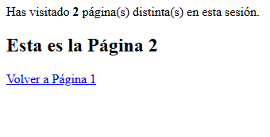

## Práctica N5 Función mail() y variables de sesión

### Sección 1: Función mail()

```php
bool mail ( string $to , string $subject , string $message [, string $additional_headers [, string 
$additional_parameters ]] ) 
Ejemplo  
<?php  
$destinatario = "xx@xx.com ";  
$asunto = "Prueba";  
$cuerpo = "Esto es una prueba de envío de correo a través del servidor";  
mail($destinatario,$asunto,$cuerpo)  
?>  
```

### 1.1) Escribir un script en PHP para poder enviar un correo electrónico, con formato HTML, a través del servidor.

```php
<?php
$destinatario = "correp@ejemplo.com";
$asunto = "Correo con formato HTML";
$cuerpo = "
<html>
<head>
  <title>Correo HTML</title>
</head>
<body>
  <h1>Hola, este es un correo con formato HTML</h1>
  <p>Este es un párrafo en <b>negrita</b> y con <i>estilo</i>.</p>
</body>
</html>
";

// Para enviar correo en formato HTML, se deben especificar las cabeceras adecuadas
$headers = "MIME-Version: 1.0" . "\r\n";
$headers .= "Content-type:text/html;charset=UTF-8" . "\r\n";

// Cabeceras adicionales
$headers .= "From: webmaster@dominio.com" . "\r\n";

if (mail($destinatario, $asunto, $cuerpo, $headers)) {
    echo "Correo enviado correctamente.";
} else {
    echo "Error al enviar el correo.";
}
?>

```

### 1.2) Confeccionar una página de Contacto que presente un formulario para que los visitantes puedan enviar consultas al webmaster.

```php
<?php
if ($_SERVER['REQUEST_METHOD'] === 'POST') {
    $nombre = htmlspecialchars(trim($_POST['nombre']));
    $email = filter_var(trim($_POST['email']), FILTER_VALIDATE_EMAIL);
    $mensaje = htmlspecialchars(trim($_POST['mensaje']));

    if ($nombre && $email && $mensaje) {
        $destinatario = "webmaster@dominio.com";
        $asunto = "Consulta desde la página de contacto";

        $cuerpo = "
        <html>
        <head><title>Consulta de $nombre</title></head>
        <body>
            <p><b>Nombre:</b> $nombre</p>
            <p><b>Email:</b> $email</p>
            <p><b>Mensaje:</b><br>" . nl2br($mensaje) . "</p>
        </body>
        </html>
        ";

        $headers = "MIME-Version: 1.0\r\n";
        $headers .= "Content-type:text/html;charset=UTF-8\r\n";
        $headers .= "From: $email\r\n";

        if (mail($destinatario, $asunto, $cuerpo, $headers)) {
            echo "<p>Gracias por contactarnos, $nombre. Te responderemos pronto.</p>";
        } else {
            echo "<p>Error al enviar el mensaje. Intenta más tarde.</p>";
        }
    } else {
        echo "<p>Por favor, completa todos los campos correctamente.</p>";
    }
}
?>

<!DOCTYPE html>
<html lang="es">
<head>
<meta charset="UTF-8" />
<title>Contacto</title>
</head>
<body>
<h2>Formulario de Contacto</h2>
<form method="post" action="">
    <label for="nombre">Nombre:</label><br />
    <input type="text" id="nombre" name="nombre" required><br />

    <label for="email">Email:</label><br />
    <input type="email" id="email" name="email" required><br />

    <label for="mensaje">Mensaje:</label><br />
    <textarea id="mensaje" name="mensaje" rows="5" required></textarea><br /><br />

    <button type="submit">Enviar</button>
</form>
</body>
</html>
```

### 1.3) Escribir un script para que un visitante recomiende el sitio a un amigo.

```php
<?php
if ($_SERVER['REQUEST_METHOD'] === 'POST') {
    $tuNombre = htmlspecialchars(trim($_POST['tuNombre']));
    $tuEmail = filter_var(trim($_POST['tuEmail']), FILTER_VALIDATE_EMAIL);
    $amigoEmail = filter_var(trim($_POST['amigoEmail']), FILTER_VALIDATE_EMAIL);

    if ($tuNombre && $tuEmail && $amigoEmail) {
        $destinatario = $amigoEmail;
        $asunto = "$tuNombre te recomienda este sitio";

        $cuerpo = "
        <html>
        <head><title>Recomendación de $tuNombre</title></head>
        <body>
            <p>Hola,</p>
            <p>$tuNombre ($tuEmail) te recomienda visitar este sitio web: <a href='https://tusitio.com'>tusitio.com</a></p>
            <p>¡Esperamos que te guste!</p>
        </body>
        </html>
        ";

        $headers = "MIME-Version: 1.0\r\n";
        $headers .= "Content-type:text/html;charset=UTF-8\r\n";
        $headers .= "From: $tuEmail\r\n";

        if (mail($destinatario, $asunto, $cuerpo, $headers)) {
            echo "<p>Correo enviado correctamente a $amigoEmail.</p>";
        } else {
            echo "<p>Error al enviar el correo. Intenta nuevamente.</p>";
        }
    } else {
        echo "<p>Por favor, completa todos los campos correctamente.</p>";
    }
}
?>

<!DOCTYPE html>
<html lang="es">
<head>
<meta charset="UTF-8" />
<title>Recomendar sitio a un amigo</title>
</head>
<body>
<h2>Recomienda este sitio a un amigo</h2>
<form method="post" action="">
    <label for="tuNombre">Tu Nombre:</label><br />
    <input type="text" id="tuNombre" name="tuNombre" required><br />

    <label for="tuEmail">Tu Email:</label><br />
    <input type="email" id="tuEmail" name="tuEmail" required><br />

    <label for="amigoEmail">Email de tu amigo:</label><br />
    <input type="email" id="amigoEmail" name="amigoEmail" required><br /><br />

    <button type="submit">Enviar recomendación</button>
</form>
</body>
</html>
```

### Sección 2: Variables de sesión

La función ``session_start()`` inicia una sesión para el usuario o continúa la sesión abierta en otras 
páginas.  
La sesión se tiene que inicializar antes de escribir cualquier texto en la página.  
Una vez inicializada, se pueden utilizar variables de sesión a través del array asociativo 
``$_SESSION["nombre _variable"]``, es decir, almacenar datos para ese usuario que se conserven 
durante toda su visita o recuperar datos almacenados en páginas que haya visitado. 


### 2.1) Contar las páginas visitadas por un usuario durante su sesión

#### session_control.php
```php
<?php
session_start();

// Inicializar el array si no existe
if (!isset($_SESSION['paginas_visitadas'])) {
    $_SESSION['paginas_visitadas'] = [];
}

// Obtener el nombre actual del script (por ejemplo: "pagina1.php")
$pagina_actual = basename($_SERVER['PHP_SELF']);

// Si la página aún no fue registrada, agregarla
if (!in_array($pagina_actual, $_SESSION['paginas_visitadas'])) {
    $_SESSION['paginas_visitadas'][] = $pagina_actual;
}

// Mostrar el número de páginas distintas visitadas
$cantidad = count($_SESSION['paginas_visitadas']);
echo "<p>Has visitado <strong>$cantidad</strong> página(s) distinta(s) en esta sesión.</p>";
?>
```

#### pagina_1.php
```php
<?php include("session_control.php"); ?>
<h2>Esta es la Página 1</h2>
<a href="pagina2.php">Ir a Página 2</a>
```

#### pagina_2.php
```php
<?php include("session_control.php"); ?>
<h2>Esta es la Página 2</h2>
<a href="pagina1.php">Volver a Página 1</a>
```
#### Salida
