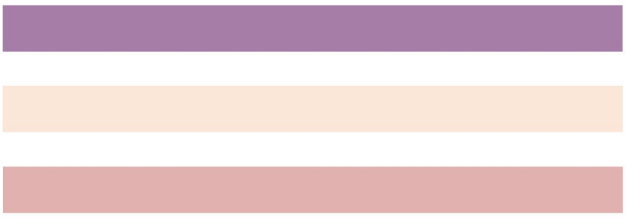

## Práctica 2: sistema de grilla o rejillas

### 1) Utilizar la grilla de Bootstrap para crear un div de clase container, que contenga dos filas. Para todas las resoluciones, excepto para sm, la primera fila deberá haber una columna que ocupe el 100% del ancho, y en la segunda deberá haber 2 columnas que ocupen el 50% del ancho cada una. Para sm y resoluciones más pequeñas, deberán haber 3 filas con 1 columna que ocupe el 100% del ancho en cada una, como se detalla en el siguiente ejemplo:

#### Ejemplo para todas las resoluciones mayores a sm:

#### Ejemplo para resoluciones igual o menores a sm:

### Resultados en:

[ej_1.html](ej_1.html)

### 2) Crear la estructura básica de un sitio web como se muestra en el ejemplo siguiente. La barra lateral (sidebar) deberá tener un tamaño de 3, al igual que los 6 rectángulos del centro del diseño. El rectángulo celeste de la esquina inferior derecha deberá tener un tamaño de 6. Utilizar el segundo mockup para el tamaño sm.

#### Ejemplo: 

#### Diseño para sm:

### Resultados en:

[ej_2.html](ej_2.html)

