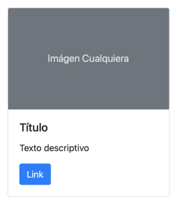

###  Práctica 3: componentes

### 1) En el div de color verde creado en el ejercicio anterior, agregarle un componente de alerta que tenga la clase alert-success con un texto cualquiera.

### 2) Dentro del sidebar, añadir un botón. Al presionar el botón deberá desplegarse un modal con 2 botones: uno para cerrarlo y otro que diga “guardar cambios”.

### 3) Crear un componente de tipo card para cada uno de los 4 rectángulos violetas, que se vean de la siguiente manera:

### 4) En el rectángulo celeste más grande (el de la esquina inferior derecha), añadir un slider con 3 imágenes.

### 5) En un nuevo documento, crear un formulario de contacto. El mismo debe contener los siguientes campos: nombre, email, teléfono, asunto y cuerpo del mensaje. Todos los campos menos el cuerpo del mensaje (que será un textarea) deberán ser inputs de texto. Añadir un botón para enviar dicho formulario.

----

### Podemmos ver los resultados de los puntos 1 al 4 en:

[index.html](index.html)

### Y el punto 5 en:

[formulario.html](formulario.html)
